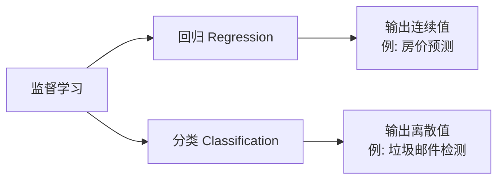

# CS229 机器学习完整笔记 — 前六章

> 本笔记涵盖 Stanford CS229 前六章全部内容，适合大厂机器学习/AI 面试复习。每个知识点包含：定义、数学公式、推导要点、面试常见问题。

---

## 目录

1. [监督学习基础](#1-监督学习基础)
2. [线性回归](#2-线性回归)
3. [分类与逻辑回归](#3-分类与逻辑回归)
4. [广义线性模型](#4-广义线性模型)
5. [生成学习算法](#5-生成学习算法)
6. [核方法](#6-核方法)
7. [支持向量机](#7-支持向量机)

---

## 1. 监督学习基础

### 1.1 核心概念

| 概念     | 符号                               | 含义                    |
| :------- | :--------------------------------- | :---------------------- |
| 输入特征 | $x^{(i)}$                          | 第 $i$ 个样本的特征向量 |
| 输出目标 | $y^{(i)}$                          | 第 $i$ 个样本的标签     |
| 训练集   | $\{(x^{(i)}, y^{(i)})\}_{i=1}^{n}$ | 包含 $n$ 个样本         |
| 假设函数 | $h_\theta(x)$                      | 模型的预测函数          |
| 参数     | $\theta$                           | 模型的可学习参数        |

### 1.2 问题类型



### 1.3 面试高频问题

**Q: 监督学习与无监督学习的区别？**

|      | 监督学习            | 无监督学习       |
| :--- | :------------------ | :--------------- |
| 数据 | 有标签 $(x, y)$     | 无标签 $x$       |
| 目标 | 学习 $x \to y$ 映射 | 发现数据内在结构 |
| 例子 | 回归、分类          | 聚类、降维       |

---

## 2. 线性回归

### 2.1 模型定义

**假设函数**（含截距项 $x_0 = 1$）：
$$h_\theta(x) = \sum_{j=0}^{d} \theta_j x_j = \theta^T x$$

**代价函数**（最小二乘）：
$$J(\theta) = \frac{1}{2} \sum_{i=1}^{n} (h_\theta(x^{(i)}) - y^{(i)})^2$$

### 2.2 优化算法

#### 批量梯度下降 (Batch GD)

$$\theta_j := \theta_j + \alpha \sum_{i=1}^{n} (y^{(i)} - h_\theta(x^{(i)})) x_j^{(i)}$$

**特点**：每一步使用全部数据，稳定但慢。

#### 随机梯度下降 (SGD)

$$\theta_j := \theta_j + \alpha (y^{(i)} - h_\theta(x^{(i)})) x_j^{(i)}$$

**特点**：每一步使用一个样本，快但有噪声。

#### Mini-batch GD

每一步使用 $B$ 个样本，是实践中常用的折中方案。

### 2.3 正规方程 (Normal Equations)

**矩阵形式**：
$$X\theta = y \quad \Rightarrow \quad \theta = (X^T X)^{-1} X^T y$$

**设计矩阵** $X \in \mathbb{R}^{n \times (d+1)}$，目标向量 $y \in \mathbb{R}^n$。

**矩阵求导关键公式**：
$$\nabla_x (b^T x) = b, \quad \nabla_x (x^T A x) = 2Ax \quad (A\text{对称})$$

### 2.4 概率解释

**核心假设**：
$$y^{(i)} = \theta^T x^{(i)} + \epsilon^{(i)}, \quad \epsilon^{(i)} \sim \mathcal{N}(0, \sigma^2)$$

**推导**：
$$p(y^{(i)}|x^{(i)};\theta) = \frac{1}{\sqrt{2\pi}\sigma} \exp\left(-\frac{(y^{(i)} - \theta^T x^{(i)})^2}{2\sigma^2}\right)$$

$$\ell(\theta) = \log L(\theta) = n\log\frac{1}{\sqrt{2\pi}\sigma} - \frac{1}{2\sigma^2}\sum_{i=1}^{n}(y^{(i)} - \theta^T x^{(i)})^2$$

**结论**：最小二乘 = 高斯噪声下的最大似然估计 (MLE)。

### 2.5 局部加权线性回归 (LWR)

**权重函数**：
$$w^{(i)} = \exp\left(-\frac{(x^{(i)} - x)^2}{2\tau^2}\right)$$

**加权代价函数**：
$$J_x(\theta) = \sum_{i=1}^{n} w^{(i)} (y^{(i)} - \theta^T x^{(i)})^2$$

**加权正规方程**：
$$\theta = (X^T W X)^{-1} X^T W y$$

**特点**：非参数化，每次预测需要重新拟合。

### 2.6 面试高频问题

**Q: 正规方程中 $(X^T X)^{-1}$ 不存在怎么办？**

1. 特征之间存在多重共线性
2. 样本数 $n$ 小于特征数 $d$
3. 解决方案：添加 $\ell_2$ 正则化（岭回归）$\theta = (X^T X + \lambda I)^{-1} X^T y$

**Q: 梯度下降中学习率 $\alpha$ 如何选择？**

- 太大：震荡不收敛
- 太小：收敛太慢
- 常用方法：学习率衰减、自适应学习率 (Adam)

---

## 3. 分类与逻辑回归

### 3.1 Sigmoid 函数

$$g(z) = \frac{1}{1 + e^{-z}}, \quad g'(z) = g(z)(1 - g(z))$$

### 3.2 模型定义

$$h_\theta(x) = g(\theta^T x) = \frac{1}{1 + e^{-\theta^T x}}$$

**概率解释**：
$$p(y|x;\theta) = h_\theta(x)^y (1 - h_\theta(x))^{1-y}, \quad y \in \{0, 1\}$$

### 3.3 对数似然与梯度

$$\ell(\theta) = \sum_{i=1}^{n} \left[ y^{(i)} \log h_\theta(x^{(i)}) + (1-y^{(i)}) \log (1 - h_\theta(x^{(i)})) \right]$$

$$\frac{\partial \ell(\theta)}{\partial \theta_j} = \sum_{i=1}^{n} (y^{(i)} - h_\theta(x^{(i)})) x_j^{(i)}$$

**梯度上升更新**：
$$\theta_j := \theta_j + \alpha (y^{(i)} - h_\theta(x^{(i)})) x_j^{(i)}$$

### 3.4 Hessian 与凸性

$$H = \sum_{i=1}^{n} -h_\theta(x^{(i)})(1 - h_\theta(x^{(i)})) x^{(i)}(x^{(i)})^T$$

**性质**：$H$ 负半正定 → $\ell(\theta)$ 是凹函数 → 全局最优。

### 3.5 牛顿法

**一维**：
$$\theta := \theta - \frac{f(\theta)}{f'(\theta)}$$

**多维**（求最大似然）：
$$\theta := \theta - H^{-1} \nabla_\theta \ell(\theta)$$

**特点**：二阶收敛，但需要计算 Hessian 逆。

### 3.6 感知机

$$g(z) = \begin{cases} +1 & z \geq 0 \\ -1 & z < 0 \end{cases}$$

**更新规则**：
$$\theta_j := \theta_j + \alpha (y^{(i)} - h_\theta(x^{(i)})) x_j^{(i)}$$

**Novikoff 收敛定理**：线性可分数据下，有限步收敛。

### 3.7 面试高频问题

**Q: 为什么逻辑回归不用平方损失？**

平方损失 $\frac{1}{2}(h_\theta(x) - y)^2$ 在逻辑回归中是非凸的，有局部最优；交叉熵损失是凸的，保证全局最优。

**Q: 逻辑回归 vs 感知机？**

|          | 逻辑回归     | 感知机            |
| :------- | :----------- | :---------------- |
| 输出     | 概率 $(0,1)$ | 离散 $\{-1, +1\}$ |
| 概率解释 | 有（MLE）    | 无                |
| 收敛     | 始终收敛     | 仅线性可分时收敛  |

---

## 4. 广义线性模型

### 4.1 指数族分布

$$p(y;\eta) = b(y) \exp(\eta^T T(y) - a(\eta))$$

**关键性质**：
$$\mathbb{E}[T(y)] = a'(\eta), \quad \text{Var}(T(y)) = a''(\eta)$$

### 4.2 常见分布的指数族形式

| 分布   | 自然参数 $\eta$               | 均值函数 $g(\eta)$                     | 响应函数 |
| :----- | :---------------------------- | :------------------------------------- | :------- |
| 高斯   | $\mu$                         | $\eta$                                 | 线性     |
| 伯努利 | $\log(\frac{\phi}{1-\phi})$   | $\frac{1}{1+e^{-\eta}}$                | Sigmoid  |
| 泊松   | $\log(\lambda)$               | $e^\eta$                               | 指数     |
| 多项式 | $\log(\frac{\phi_i}{\phi_k})$ | $\frac{e^{\eta_i}}{\sum_j e^{\eta_j}}$ | Softmax  |

### 4.3 GLM 三大假设

1. **分布假设**：$y|x;\theta \sim \text{ExponentialFamily}(\eta)$
2. **目标假设**：$h_\theta(x) = \mathbb{E}[T(y)|x]$
3. **线性假设**：$\eta = \theta^T x$

### 4.4 三种典型 GLM

**线性回归**（高斯）：
$$h_\theta(x) = \theta^T x$$

**逻辑回归**（伯努利）：
$$h_\theta(x) = \frac{1}{1 + e^{-\theta^T x}}$$

**Softmax 回归**（多项式）：
$$h_\theta(x)_i = \frac{e^{\theta_i^T x}}{\sum_{j=1}^{k} e^{\theta_j^T x}}$$

### 4.5 面试高频问题

**Q: 为什么 GLM 选择 $\eta = \theta^T x$？**

这是设计选择而非数学必然，保证了模型的简单性、可解释性和凸性。也可使用 $\eta = \theta^T \phi(x)$（核方法/深度学习）。

---

## 5. 生成学习算法

### 5.1 判别 vs 生成

|      | 判别模型      | 生成模型        |
| :--- | :------------ | :-------------- | ---- | ------------- |
| 建模 | $p(y          | x)$ 直接        | $p(x | y)$ 和 $p(y)$ |
| 目标 | 决策边界      | 数据生成过程    |
| 例子 | 逻辑回归、SVM | GDA、朴素贝叶斯 |

**贝叶斯法则**：
$$p(y|x) = \frac{p(x|y)p(y)}{p(x)}, \quad p(x) = \sum_y p(x|y)p(y)$$

$$\hat{y} = \arg\max_y p(y|x) = \arg\max_y p(x|y)p(y)$$

### 5.2 高斯判别分析 (GDA)

**模型假设**：
$$y \sim \text{Bernoulli}(\phi), \quad x|y=0 \sim \mathcal{N}(\mu_0, \Sigma), \quad x|y=1 \sim \mathcal{N}(\mu_1, \Sigma)$$

**MLE 参数估计**：
$$\phi = \frac{1}{n} \sum_{i=1}^{n} \mathbf{1}\{y^{(i)}=1\}$$

$$\mu_0 = \frac{\sum_i \mathbf{1}\{y^{(i)}=0\} x^{(i)}}{\sum_i \mathbf{1}\{y^{(i)}=0\}}, \quad \mu_1 = \frac{\sum_i \mathbf{1}\{y^{(i)}=1\} x^{(i)}}{\sum_i \mathbf{1}\{y^{(i)}=1\}}$$

$$\Sigma = \frac{1}{n} \sum_{i=1}^{n} (x^{(i)} - \mu_{y^{(i)}})(x^{(i)} - \mu_{y^{(i)}})^T$$

### 5.3 GDA vs 逻辑回归

**关键关系**：GDA 假设 $p(x|y)$ 为高斯（共享 $\Sigma$）→ $p(y|x)$ 为逻辑函数。

|          | GDA            | 逻辑回归       |
| :------- | :------------- | :------------- |
| 假设强度 | 强（高斯分布） | 弱（线性边界） |
| 数据效率 | 高             | 低             |
| 鲁棒性   | 低             | 高             |

### 5.4 朴素贝叶斯

**条件独立假设**：
$$p(x_1, \ldots, x_d | y) = \prod_{j=1}^{d} p(x_j | y)$$

**参数**（二分类）：
$$\phi_{j|y=1} = \frac{\sum_i \mathbf{1}\{x_j^{(i)}=1, y^{(i)}=1\}}{\sum_i \mathbf{1}\{y^{(i)}=1\}}, \quad \phi_y = \frac{1}{n}\sum_i \mathbf{1}\{y^{(i)}=1\}$$

**拉普拉斯平滑**：
$$\phi_{j|y=1} = \frac{1 + \sum_i \mathbf{1}\{x_j^{(i)}=1, y^{(i)}=1\}}{2 + \sum_i \mathbf{1}\{y^{(i)}=1\}}$$

### 5.5 多项式事件模型

**数据表示**：$x_j$ 为第 $j$ 个位置的词索引（$x_j \in \{1, \ldots, |V|\}$）

**参数**：
$$\phi_{k|y=1} = \frac{1 + \sum_i \sum_j \mathbf{1}\{x_j^{(i)}=k, y^{(i)}=1\}}{|V| + \sum_i \mathbf{1}\{y^{(i)}=1\} \cdot m_i}$$

**伯努利 vs 多项式**：

|      | 伯努利模型    | 多项式模型 |
| :--- | :------------ | :--------- |
| 特征 | 词出现/不出现 | 词频       |
| 适合 | 短文档        | 长文档     |

### 5.6 面试高频问题

**Q: 为什么 GDA 假设所有类别共享协方差矩阵 $\Sigma$？**

1. 减少参数数量（$2 \cdot d(d+1)/2 \to d(d+1)/2$）
2. 决策边界为线性（与逻辑回归一致）
3. 小样本下更稳定

---

## 6. 核方法

### 6.1 特征映射

$$\phi: \mathcal{X} \to \mathbb{R}^p$$

**核函数**：
$$K(x, z) = \langle \phi(x), \phi(z) \rangle = \phi(x)^T \phi(z)$$

### 6.2 常见核函数

| 核       | 表达式                                        | 特征空间维度 |
| :------- | :-------------------------------------------- | :----------- |
| 线性     | $K(x,z) = x^T z$                              | $d$          |
| 多项式   | $K(x,z) = (1 + x^T z)^p$                      | $C(d+p, p)$  |
| 高斯/RBF | $K(x,z) = \exp(-\frac{\|x-z\|^2}{2\sigma^2})$ | $\infty$     |

### 6.3 核化线性回归

**表示定理**：$\theta = \sum_i \beta_i \phi(x^{(i)})$

**核矩阵**：$K_{ij} = K(x^{(i)}, x^{(j)})$

**预测**：$h(x) = \sum_i \beta_i K(x^{(i)}, x)$

### 6.4 核函数的有效性

**Mercer 定理**：$K$ 是有效核函数 ⟺ 任意有限点集的核矩阵对称正半定。

**核矩阵正半定条件**：
$$c^T K c = \sum_{i,j} c_i c_j K(x^{(i)}, x^{(j)}) \geq 0, \quad \forall c \in \mathbb{R}^n$$

### 6.5 面试高频问题

**Q: 核技巧的核心思想是什么？**

通过核函数 $K(x,z) = \langle \phi(x), \phi(z) \rangle$ 隐式计算高维特征空间的内积，避免显式构造高维特征向量。

**Q: 高斯核对应无限维特征空间，为什么？**

泰勒展开：
$$K(x,z) = \exp\left(-\frac{\|x-z\|^2}{2\sigma^2}\right) = \sum_{k=0}^{\infty} \frac{1}{k!} \left(\frac{x^T z}{\sigma^2}\right)^k$$
对应无限多个单项式特征。

---

## 7. 支持向量机

### 7.1 间隔定义

**符号**：$y \in \{-1, +1\}$，分类器 $h_{w,b}(x) = \text{sign}(w^T x + b)$

**函数间隔**：
$$\hat{\gamma}^{(i)} = y^{(i)}(w^T x^{(i)} + b)$$

**几何间隔**（实际距离）：
$$\gamma^{(i)} = \frac{y^{(i)}(w^T x^{(i)} + b)}{\|w\|}$$

**关系**：$\gamma = \frac{\hat{\gamma}}{\|w\|}$（尺度不变性）

### 7.2 硬间隔 SVM

**原始问题**：
$$\min_{w,b} \frac{1}{2}\|w\|^2$$
$$\text{s.t.} \quad y^{(i)}(w^T x^{(i)} + b) \geq 1, \quad i = 1, \ldots, n$$

### 7.3 拉格朗日对偶

**拉格朗日函数**：
$$\mathcal{L}(w, b, \alpha) = \frac{1}{2}\|w\|^2 - \sum_{i=1}^{n} \alpha_i [y^{(i)}(w^T x^{(i)} + b) - 1]$$

**KKT 条件**：
$$w = \sum_i \alpha_i y^{(i)} x^{(i)}, \quad \sum_i \alpha_i y^{(i)} = 0, \quad \alpha_i \geq 0, \quad \alpha_i [y^{(i)}(w^T x^{(i)} + b) - 1] = 0$$

### 7.4 对偶问题

$$\max_{\alpha} W(\alpha) = \sum_{i=1}^{n} \alpha_i - \frac{1}{2} \sum_{i,j=1}^{n} y^{(i)} y^{(j)} \alpha_i \alpha_j \langle x^{(i)}, x^{(j)} \rangle$$
$$\text{s.t.} \quad \alpha_i \geq 0, \quad \sum_{i=1}^{n} \alpha_i y^{(i)} = 0$$

**预测**：
$$f(x) = \sum_{i=1}^{n} \alpha_i y^{(i)} \langle x^{(i)}, x \rangle + b$$

### 7.5 软间隔 SVM

**引入松弛变量** $\xi_i \geq 0$：
$$y^{(i)}(w^T x^{(i)} + b) \geq 1 - \xi_i$$

$$\min_{w,b,\xi} \frac{1}{2}\|w\|^2 + C \sum_{i=1}^{n} \xi_i$$

**对偶约束变为**：$0 \leq \alpha_i \leq C$

### 7.6 KKT 条件的三种情况

| $\alpha_i$         | 含义                           |
| :----------------- | :----------------------------- |
| $\alpha_i = 0$     | 正确分类，远离边界             |
| $0 < \alpha_i < C$ | 支持向量，恰在边界上           |
| $\alpha_i = C$     | 支持向量，在边界内或被错误分类 |

### 7.7 合页损失

$$\ell_{\text{hinge}}(z) = \max(0, 1 - z), \quad z = y(w^T x + b)$$

**软间隔 SVM = 合页损失 + $\ell_2$ 正则化**：
$$\min_{w,b} \frac{1}{2}\|w\|^2 + C \sum_{i=1}^{n} \max(0, 1 - y^{(i)}(w^T x^{(i)} + b))$$

### 7.8 SMO 算法

**核心思想**：每次只优化两个 $\alpha$ 变量（因为 $\sum \alpha_i y_i = 0$ 约束）

**$\alpha_2$ 更新**：
$$\alpha_2^{\text{new, unc}} = \alpha_2^{\text{old}} + \frac{y^{(2)}(E_1 - E_2)}{\eta}$$
$$\eta = K_{11} + K_{22} - 2K_{12}, \quad E_i = f(x^{(i)}) - y^{(i)}$$

**裁剪**：$\alpha_2^{\text{new}} = \text{clip}(\alpha_2^{\text{new, unc}}, L, H)$

**启发式选择**：优先选择违反 KKT 条件的样本

### 7.9 SVM 核化

对偶问题中替换内积：
$$\langle x^{(i)}, x^{(j)} \rangle \to K(x^{(i)}, x^{(j)})$$

**预测**：
$$f(x) = \sum_{i=1}^{n} \alpha_i y^{(i)} K(x^{(i)}, x) + b$$

### 7.10 面试高频问题

**Q: SVM 为什么对离群点敏感？如何解决？**

硬间隔 SVM 要求所有点满足 $y(w^T x + b) \geq 1$，离群点会导致超平面剧烈摆动。解决方案：使用软间隔 SVM，引入松弛变量 $\xi_i$ 和正则化参数 $C$。

**Q: SVM 的对偶形式有什么好处？**

1. 自然引入核技巧
2. 揭示支持向量的稀疏性
3. 对偶变量 $\alpha$ 数量为 $n$，当 $n \ll d$ 时更高效

**Q: 如何理解支持向量的稀疏性？**

KKT 互补条件 $\alpha_i [y^{(i)}(w^T x^{(i)} + b) - 1] = 0$ 意味着非支持向量 $\alpha_i = 0$，预测只依赖支持向量。

**Q: 为什么 $C$ 在偏差-方差权衡中起关键作用？**

| $C$          | 行为             | 偏差/方差                |
| :----------- | :--------------- | :----------------------- |
| $\to \infty$ | 硬间隔，完美分类 | 高方差，低偏差（过拟合） |
| 中等         | 允许少量违规     | 平衡（最优）             |
| $\to 0$      | 最大化间隔       | 低方差，高偏差（欠拟合） |

---

## 速查表：核心算法对比

| 算法         | 类型 | 核心公式                                                    | 适用场景                         |
| :----------- | :--- | :---------------------------------------------------------- | :------------------------------- | -------------- | -------- |
| 线性回归     | 回归 | $h(x) = \theta^T x$                                         | 连续值预测                       |
| 逻辑回归     | 分类 | $h(x) = \frac{1}{1+e^{-\theta^T x}}$                        | 二分类                           |
| Softmax 回归 | 分类 | $h(x)_i = \frac{e^{\theta_i^T x}}{\sum_j e^{\theta_j^T x}}$ | 多分类                           |
| GDA          | 分类 | $p(x                                                        | y) = \mathcal{N}(\mu_y, \Sigma)$ | 小样本高斯数据 |
| 朴素贝叶斯   | 分类 | $p(x                                                        | y) = \prod_j p(x_j               | y)$            | 文本分类 |
| SVM          | 分类 | $\min \frac{1}{2}\|w\|^2$                                   | 非线性、高维分类                 |

---

## 面试必备：思维导图

```
机器学习前六章核心脉络
│
├── 回归基础
│   ├── 线性回归 → 正规方程 → 概率解释 (MLE)
│   └── 局部加权回归 (LWR) → 非参数化
│
├── 分类核心
│   ├── 逻辑回归 → 交叉熵 → 牛顿法
│   └── 感知机 → 收敛定理
│
├── 统一框架
│   └── GLM → 指数族 → 三大假设 → 线性/逻辑/Softmax
│
├── 生成模型
│   ├── GDA → 高斯假设 → 与逻辑回归关系
│   └── 朴素贝叶斯 → 条件独立 → 拉普拉斯平滑
│
├── 核方法
│   ├── 特征映射 φ(x)
│   ├── 核函数 K(x,z) = ⟨φ(x), φ(z)⟩
│   └── Mercer 定理 → 核矩阵正半定
│
└── SVM (顶峰)
    ├── 间隔 → 函数/几何间隔
    ├── 对偶 → 拉格朗日 → KKT
    ├── 软间隔 → C 正则化 → 合页损失
    └── SMO → 两变量优化
```

---

> **面试建议**：
>
> 1. 深刻理解每个算法的**优化目标**和**概率假设**
> 2. 掌握**偏差-方差**视角分析不同算法
> 3. 理解**生成 vs 判别**的本质区别
> 4. 掌握**核技巧**如何将线性算法变为非线性
> 5. 理解 SVM 的**对偶推导**和**KKT 条件**含义
