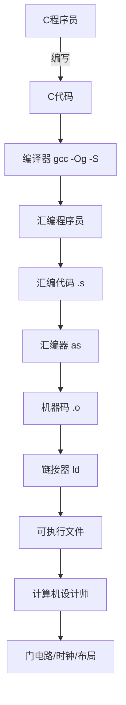

# x86-64 汇编语言基础
## 📖 目录

1. [计算机系统的抽象层次](#1-计算机系统的抽象层次)
2. [x86-64 寄存器](#2-x86-64-寄存器)
3. [数据传送指令（mov）](#3-数据传送指令mov)
4. [内存寻址模式](#4-内存寻址模式)
5. [算术与逻辑运算](#5-算术与逻辑运算)
6. [条件码与跳转](#6-条件码与跳转)
7. [从 C 到汇编的完整流程](#7-从-c-到汇编的完整流程)
8. [速查卡片](#8-速查卡片)

---

## 1. 计算机系统的抽象层次

### 1.1 三层视角



### 1.2 关键概念对比

| 概念                 | 定义                           | 示例                   |
| -------------------- | ------------------------------ | ---------------------- |
| **ISA** (指令集架构) | 程序员需要理解的处理器设计部分 | 指令集规范、寄存器定义 |
| **微架构**           | ISA 的具体实现                 | 缓存大小、核心频率     |
| **机器码**           | 处理器执行的字节级程序         | `0x48 0x89 0x03`       |
| **汇编代码**         | 机器码的文本表示               | `movq %rax, (%rbx)`    |

### 1.3 CPU 数据存储

| 存储类型        | 位置       | 速度 | 容量        | 访问方式 |
| --------------- | ---------- | ---- | ----------- | -------- |
| **寄存器**      | CPU 核心内 | 极快 | ~16个，64位 | 寄存器名 |
| **内存 (DRAM)** | 芯片外     | 慢   | GB级        | 字节地址 |

> 💡 **局部变量**（如 `int x = 5;`）在频繁操作时通常存储在寄存器中。

---

## 2. x86-64 寄存器

### 2.1 历史演进

```
16-bit (8086, 1978)  →  32-bit (80386, 1985)  →  64-bit (AMD64, 2003)
     ax                      eax                      rax
     bx                      ebx                      rbx
     cx                      ecx                      rcx
     dx                      edx                      rdx
```

### 2.2 通用寄存器全景图

| 64-bit | 32-bit | 16-bit | 8-bit (低字节) | 用途惯例     |
| ------ | ------ | ------ | -------------- | ------------ |
| `%rax` | `%eax` | `%ax`  | `%al`          | 返回值       |
| `%rbx` | `%ebx` | `%bx`  | `%bl`          | 被调用者保存 |
| `%rcx` | `%ecx` | `%cx`  | `%cl`          | 第4个参数    |
| `%rdx` | `%edx` | `%dx`  | `%dl`          | 第3个参数    |
| `%rsi` | `%esi` | `%si`  | `%sil`         | 第2个参数    |
| `%rdi` | `%edi` | `%di`  | `%dil`         | 第1个参数    |
| `%rbp` | `%ebp` | `%bp`  | `%bpl`         | 栈帧基址     |
| `%rsp` | `%esp` | `%sp`  | `%spl`         | 栈指针       |

**扩展寄存器 (r8-r15)：**

| 64-bit | 32-bit  | 16-bit  | 8-bit (低字节) |
| ------ | ------- | ------- | -------------- |
| `%r8`  | `%r8d`  | `%r8w`  | `%r8b`         |
| `%r9`  | `%r9d`  | `%r9w`  | `%r9b`         |
| ...    | ...     | ...     | ...            |
| `%r15` | `%r15d` | `%r15w` | `%r15b`        |

### 2.3 调用约定 (Calling Convention)

```c
// C 函数声明
long func(long a, long b, long c, long d, long e, long f);

// 参数传递映射：
// 第1个 → %rdi
// 第2个 → %rsi
// 第3个 → %rdx
// 第4个 → %rcx
// 第5个 → %r8
// 第6个 → %r9
// 返回值 → %rax
```

---

## 3. 数据传送指令（mov）

### 3.1 操作数后缀

| 后缀 | 含义        | 字节数 | 示例   |
| ---- | ----------- | ------ | ------ |
| `b`  | byte        | 1      | `movb` |
| `w`  | word        | 2      | `movw` |
| `l`  | double word | 4      | `movl` |
| `q`  | quad word   | 8      | `movq` |

### 3.2 movq 基本用法

```assembly
# 立即数 → 寄存器
movq $5, %rax          # x = 5

# 寄存器 → 寄存器
movq %rcx, %rdx        # x = y

# 内存 → 寄存器
movq (%rsi), %r8       # x = *p

# 寄存器 → 内存
movq %rax, (%rbx)      # *dest = t
```

### 3.3 完整示例：swap 函数

**C 代码：**
```c
void swap(long *xp, long *yp) {
    long t0 = *xp;
    long t1 = *yp;
    *xp = t1;
    *yp = t0;
}
```

**汇编代码：**
```assembly
swap:
    movq (%rdi), %rax    # t0 = *xp    (xp 在 %rdi)
    movq (%rsi), %rdx    # t1 = *yp    (yp 在 %rsi)
    movq %rdx, (%rdi)    # *xp = t1
    movq %rax, (%rsi)    # *yp = t0
    ret
```

**内存变化追踪：**

```
初始状态：
%rdi = 0x120  (指向地址 0x120)
%rsi = 0x100  (指向地址 0x100)

内存：
地址 0x120: 123
地址 0x100: 456

执行后：
地址 0x120: 456  ← 交换完成
地址 0x100: 123
```

> ⚠️ **注意**：x86-64 **不允许**内存到内存的直接传送！
> ```assembly
> ❌ movq (%rdi), (%rsi)    # 错误！两个内存操作数
> ✅ movq (%rdi), %rax      # 正确：先加载到寄存器
> ✅ movq %rax, (%rsi)      # 再存回内存
> ```

---

## 4. 内存寻址模式

### 4.1 通用寻址公式

```
D(%Rb, %Ri, S) = Mem[ Reg[Rb] + S × Reg[Ri] + D ]

其中：
  D  = 常量位移 (1, 2, 或 4 字节)
  Rb = 基址寄存器 (任意通用寄存器)
  Ri = 索引寄存器 (除 %rsp 外)
  S  = 比例因子 (1, 2, 4, 或 8)
```

### 4.2 寻址模式示例

| 汇编语法              | 等效 C 表达式           | 说明       |
| --------------------- | ----------------------- | ---------- |
| `(%rdi)`              | `*rdi`                  | 简单解引用 |
| `(%rdi, %rsi)`        | `*(rdi + rsi)`          | 基址+索引  |
| `(%rdi, %rsi, 4)`     | `*(rdi + 4*rsi)`        | 比例索引   |
| `0x80(%rdi, %rsi, 4)` | `*(rdi + 4*rsi + 0x80)` | 完整形式   |

### 4.3 实战：数组访问

**char 数组 (元素 1 字节)：**
```c
char *d;
int y;
char a = '\0';
d[y] = a;
```
```assembly
movq %rax, (%rdi, %rsi)    # 存储 1 字节
```

**int 数组 (元素 4 字节)：**
```c
int *d;
int y;
int a = 67;
d[y] = a;
```
```assembly
movl %eax, (%rdi, %rsi, 4)    # 存储 4 字节，比例因子为 4
```

**long 数组 (元素 8 字节)：**
```c
long *d;
long y;
long a = 67;
d[y] = a;
```
```assembly
movq %rax, (%rdi, %rsi, 8)    # 存储 8 字节，比例因子为 8
```

### 4.4 地址计算练习

假设：`%rdx = 0xF000`, `%rcx = 0x0100`

| 表达式            | 计算过程          | 结果地址 |
| ----------------- | ----------------- | -------- |
| `0x8(%rdx)`       | 0xF000 + 0x8      | 0xF008   |
| `(%rdx, %rcx)`    | 0xF000 + 0x0100   | 0xF100   |
| `(%rdx, %rcx, 4)` | 0xF000 + 4×0x0100 | 0xF400   |
| `0x80(, %rdx, 2)` | 0x80 + 2×0xF000   | 0x1E080  |

### 4.5 leaq：地址计算指令

`leaq` (Load Effective Address) 不访问内存，只计算地址。

```assembly
# leaq Src, Dst   →  Dst = &Src

# 示例：计算 x*12
long m12(long x) {
    return x * 12;
}
```
```assembly
m12:
    leaq (%rdi, %rdi, 2), %rax    # t = x + 2*x = 3*x
    salq $2, %rax                 # return t << 2 = 12*x
    ret
```

> 💡 `leaq` 常用于高效算术运算（利用 `S` 为 1,2,4,8 的特性）。

---

## 5. 算术与逻辑运算

### 5.1 双操作数指令

| 指令    | 格式              | 计算                        | C 等价        |
| ------- | ----------------- | --------------------------- | ------------- |
| `addq`  | `addq Src, Dest`  | `Dest = Dest + Src`         | `+=`          |
| `subq`  | `subq Src, Dest`  | `Dest = Dest - Src`         | `-=`          |
| `imulq` | `imulq Src, Dest` | `Dest = Dest * Src`         | `*=`          |
| `salq`  | `salq Src, Dest`  | `Dest = Dest << Src`        | `<<=`         |
| `sarq`  | `sarq Src, Dest`  | `Dest = Dest >> Src` (算术) | `>>` (有符号) |
| `shrq`  | `shrq Src, Dest`  | `Dest = Dest >> Src` (逻辑) | `>>` (无符号) |
| `xorq`  | `xorq Src, Dest`  | `Dest = Dest ^ Src`         | `^=`          |
| `andq`  | `andq Src, Dest`  | `Dest = Dest & Src`         | `&=`          |
| `orq`   | `orq Src, Dest`   | `Dest = Dest \| Src`        | `\|=`         |

### 5.2 单操作数指令

| 指令   | 格式        | 计算              | C 等价 |
| ------ | ----------- | ----------------- | ------ |
| `incq` | `incq Dest` | `Dest = Dest + 1` | `++`   |
| `decq` | `decq Dest` | `Dest = Dest - 1` | `--`   |
| `negq` | `negq Dest` | `Dest = -Dest`    | `-`    |
| `notq` | `notq Dest` | `Dest = ~Dest`    | `~`    |

### 5.3 完整示例：复杂算术表达式

**C 代码：**
```c
long arith(long x, long y, long z) {
    long t1 = x + y;
    long t2 = z + t1;
    long t3 = x + 4;
    long t4 = y * 48;
    long t5 = t3 + t4;
    long rval = t2 * t5;
    return rval;
}
```

**汇编代码：**
```assembly
arith:
    leaq (%rdi, %rsi), %rax      # t1 = x + y
    addq %rdx, %rax              # t2 = z + t1
    leaq (%rsi, %rsi, 2), %rdx   # t4 = y + 2*y = 3*y
    salq $4, %rdx                # t4 = 3*y << 4 = 48*y
    leaq 4(%rdi, %rdx), %rcx     # t5 = x + t4 + 4
    imulq %rcx, %rax             # rval = t2 * t5
    ret
```

**寄存器使用追踪：**

| 寄存器 | 存储的变量     |
| ------ | -------------- |
| `%rdi` | x (参数)       |
| `%rsi` | y (参数)       |
| `%rdx` | z → t4         |
| `%rax` | t1 → t2 → rval |
| `%rcx` | t5             |

---

## 6. 条件码与跳转

### 6.1 条件码寄存器

x86-64 维护一组 1 位的条件码：

| 标志   | 含义     | 设置条件   |
| ------ | -------- | ---------- |
| **CF** | 进位标志 | 无符号溢出 |
| **ZF** | 零标志   | 结果为 0   |
| **SF** | 符号标志 | 结果为负   |
| **OF** | 溢出标志 | 有符号溢出 |

### 6.2 设置条件码的指令

**`cmp` 指令：**
```assembly
cmpq Src2, Src1    # 计算 Src1 - Src2，设置条件码，不修改 Src1
```
相当于 `subq` 但不保存结果。

**`test` 指令：**
```assembly
testq Src2, Src1   # 计算 Src1 & Src2，设置 ZF 和 SF
```
常用于测试是否为零：
```assembly
testq %rax, %rax   # 检查 %rax 是否为 0
je   .Lzero        # 如果为零跳转
```

### 6.3 条件跳转指令

| 指令          | 条件           | 含义              | 适用场景 |
| ------------- | -------------- | ----------------- | -------- |
| `jmp`         | 1              | 无条件跳转        | 始终跳转 |
| `je` / `jz`   | ZF             | 相等 / 为零       | `==`     |
| `jne` / `jnz` | ~ZF            | 不等 / 非零       | `!=`     |
| `js`          | SF             | 负数              | `< 0`    |
| `jns`         | ~SF            | 非负数            | `>= 0`   |
| `jg`          | ~(SF^OF) & ~ZF | 大于 (有符号)     | `>`      |
| `jge`         | ~(SF^OF)       | 大于等于 (有符号) | `>=`     |
| `jl`          | SF^OF          | 小于 (有符号)     | `<`      |
| `jle`         | (SF^OF) \| ZF  | 小于等于 (有符号) | `<=`     |
| `ja`          | ~CF & ~ZF      | 大于 (无符号)     | `>`      |
| `jb`          | CF             | 小于 (无符号)     | `<`      |

### 6.4 完整示例：if-else

**C 代码：**
```c
extern void op1(void);
extern void op2(void);

void decision(int x) {
    if (x) {
        op1();
    } else {
        op2();
    }
}
```

**汇编代码：**
```assembly
decision:
    testl %edi, %edi    # 检查 x (x 在 %edi)
    je   .L2            # if (x == 0) 跳转到 else
    call op1            # then 分支
    jmp  .L1            # 跳过 else
.L2:
    call op2            # else 分支
.L1:
    ret
```

### 6.5 条件码的隐式设置

> ⚠️ **大多数算术指令都会设置条件码**，但 `leaq` **不会**！

```assembly
addq %rax, %rbx    # ✅ 设置条件码
subq %rcx, %rdx    # ✅ 设置条件码
leaq (%rdi,%rsi), %rax  # ❌ 不设置条件码
```

---

## 7. 从 C 到汇编的完整流程

### 7.1 编译流水线

```bash
# 步骤 1: 生成汇编文件 (.s)
gcc -Og -S sum.c

# 步骤 2: 生成目标文件 (.o)
gcc -Og -c sum.c

# 步骤 3: 生成可执行文件
gcc -Og sum.c -o sum

# 步骤 4: 查看汇编 (无需生成文件)
gcc -Og -S sum.c -o -
```

### 7.2 完整示例

**C 代码 (sum.c)：**
```c
long plus(long x, long y);

void sumstore(long x, long y, long *dest) {
    long t = plus(x, y);
    *dest = t;
}
```

**生成的汇编 (sum.s)：**
```assembly
sumstore:
    pushq %rbx           # 保存 %rbx
    movq  %rdx, %rbx     # 保存 dest 指针
    call  plus           # 调用 plus(x, y)
    movq  %rax, (%rbx)   # *dest = 返回值
    popq  %rbx           # 恢复 %rbx
    ret
```

**机器码 (objdump -d 输出)：**
```assembly
0000000000400595 <sumstore>:
  400595: 53                 push   %rbx
  400596: 48 89 d3           mov    %rdx,%rbx
  400599: e8 f2 ff ff ff     callq  400590 <plus>
  40059e: 48 89 03           mov    %rax,(%rbx)
  4005a1: 5b                 pop    %rbx
  4005a2: c3                 retq
```

### 7.3 调试器中使用

```bash
# 启动 GDB
gdb sum

# 反汇编函数
(gdb) disassemble sumstore

# 查看机器码 (14 字节)
(gdb) x/14xb sumstore
```

---

## 8. 速查卡片

### 📋 寄存器速查

| 用途    | 寄存器 |
| ------- | ------ |
| 返回值  | `%rax` |
| 第1参数 | `%rdi` |
| 第2参数 | `%rsi` |
| 第3参数 | `%rdx` |
| 第4参数 | `%rcx` |
| 第5参数 | `%r8`  |
| 第6参数 | `%r9`  |
| 栈指针  | `%rsp` |

### 📋 常用指令速查

| 指令    | 示例                       | 说明        |
| ------- | -------------------------- | ----------- |
| `movq`  | `movq %rax, (%rbx)`        | 传送 8 字节 |
| `leaq`  | `leaq (%rdi,%rsi,4), %rax` | 计算地址    |
| `addq`  | `addq %rsi, %rdi`          | 加法        |
| `subq`  | `subq %rsi, %rdi`          | 减法        |
| `imulq` | `imulq %rsi, %rdi`         | 乘法        |
| `salq`  | `salq $2, %rax`            | 左移        |
| `sarq`  | `sarq $2, %rax`            | 算术右移    |
| `cmpq`  | `cmpq %rsi, %rdi`          | 比较        |
| `testq` | `testq %rax, %rax`         | 测试为零    |
| `je`    | `je .Llabel`               | 相等跳转    |
| `jmp`   | `jmp .Llabel`              | 无条件跳转  |
| `call`  | `call plus`                | 调用函数    |
| `ret`   | `ret`                      | 返回        |

### 📋 寻址模式速查

```
立即数:     $5
寄存器:     %rax
内存:
  (%rax)              →  *rax
  D(%rax)             →  *(rax + D)
  (%rax, %rbx)        →  *(rax + rbx)
  D(%rax, %rbx, S)    →  *(rax + S*rbx + D)
```

### ✅ 核心要点

- [ ] x86-64 有 16 个通用寄存器，每个 64 位
- [ ] `mov` 指令不能直接从内存到内存
- [ ] `leaq` 计算地址但不访问内存，常用于算术
- [ ] 条件码由算术指令隐式设置（`leaq` 除外）
- [ ] 跳转指令使用条件码进行控制流
- [ ] 汇编后缀 `b/w/l/q` 表示操作数大小 (1/2/4/8 字节)
- [ ] 调用约定：参数在 `%rdi, %rsi, %rdx, %rcx, %r8, %r9`，返回值在 `%rax`

---

### 📚 下一步学习

- 栈与函数调用 (`push`, `pop`, `call`, `ret`)
- 更复杂的控制流 (循环、switch)
- 数据布局与结构体
- 缓冲区溢出与安全

---

> 💡 **练习建议**：用 `gcc -Og -S` 编译自己的 C 代码，观察编译器生成的汇编，对照本教程理解每条指令的含义。