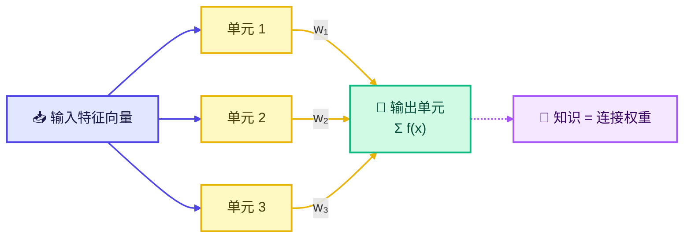
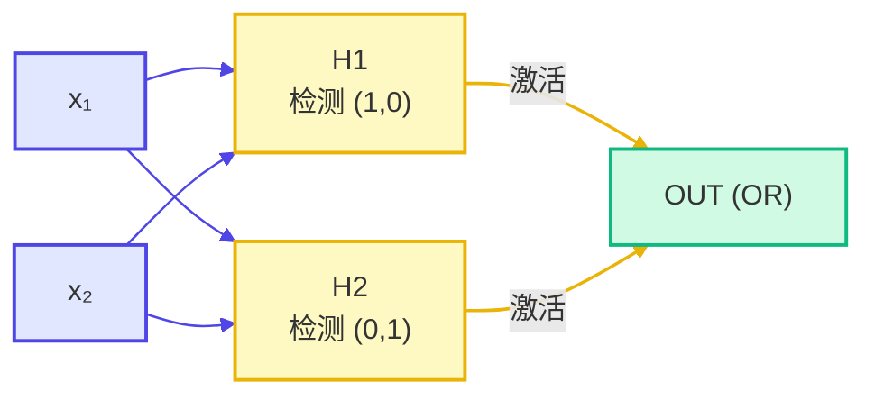
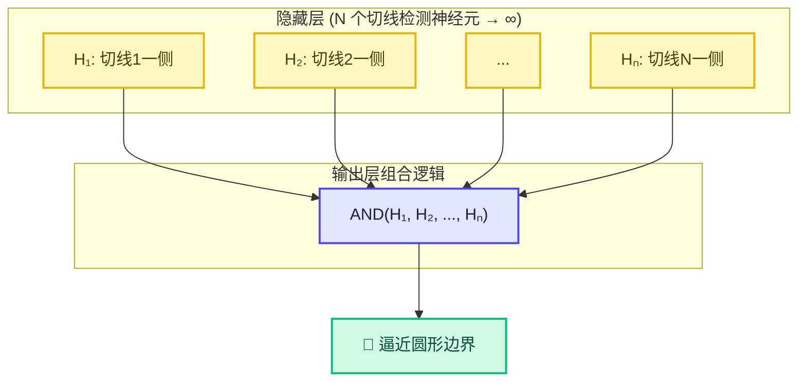
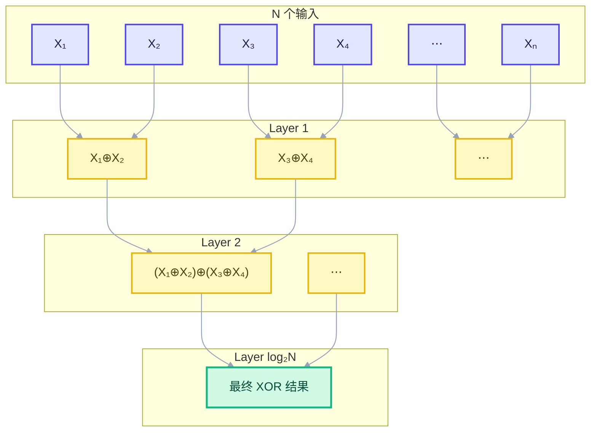
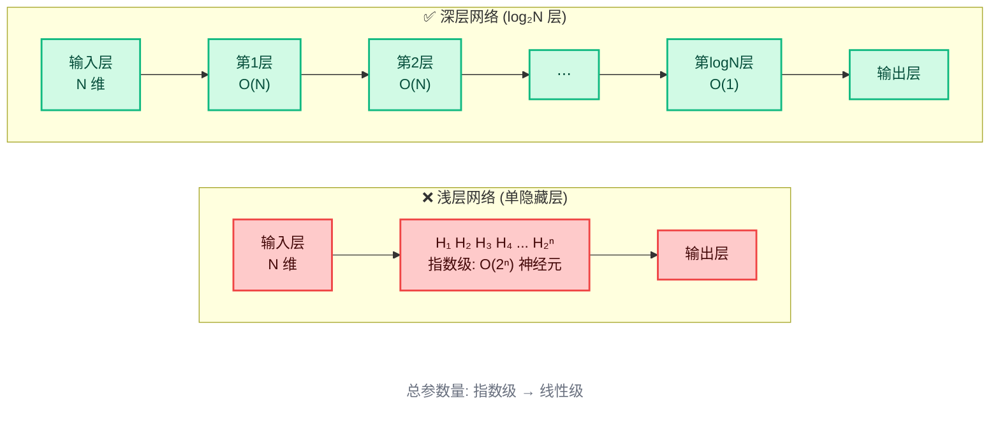
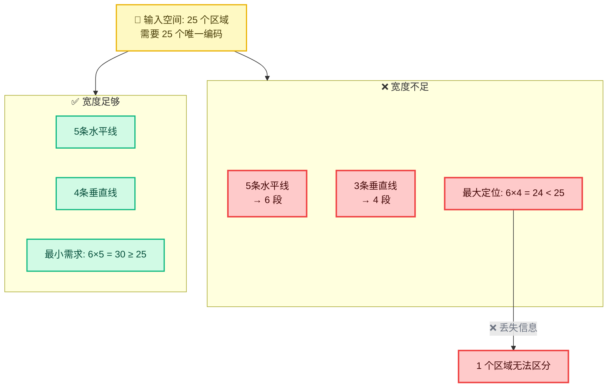
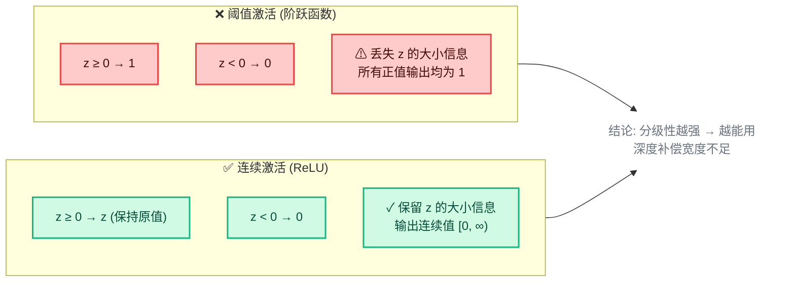

# lec01-02 深度网络的理论基础

**Lecture 1: Introduction & History**<br>
**Lecture 2: Neural Networks as Universal Approximators**

---

# 一、课程定位与核心哲学

## 1.1 课程三大目标

1.  **理解理论**：掌握神经网络背后的"是什么、为什么、怎么做"（数学原理与历史脉络）。
2.  **自主构建**：能够从零构建神经网络的核心组件与工具（作业Part 1 + Bonus）。
3.  **处理大规模问题**：具备解决工业级规模问题的能力（作业Part 2 + 课程项目）。

## 1.2 核心理念：连接主义 (Connectionism)

-   **定义**：所有世界知识都存储在**处理单元之间的连接**之中。
-   **对立范式**：冯·诺依曼机（程序=指令序列 + 独立内存地址）。
-   **基本结构**：
    -   网络：多个非线性处理单元
    -   程序：单元之间的连接
    -   记忆：连接中隐含的权重



## 1.3 教学方式

-   **讲授风格**：冗长、大量可视化、动画辅助理解（重图示轻符号推导）。
-   **课堂参与**：
    -   随机点名（使用"宝可梦"代号），被点到的学生必须回答问题。
    -   课堂上禁止使用智能设备（除投票、看幻灯片、记笔记外）。
-   **学术诚信**：允许讨论思路，严禁分享/抄袭代码。Piazza是官方交流平台。

---

# 二、历史脉络：从哲学到现代神经网络

## 2.1 联想主义 (Associationism)：思想的源头

-   **时间**：公元前400年 - 1900年
-   **代表人物**：柏拉图、大卫·休谟、伊万·巴甫洛夫
-   **核心思想**：人类通过学习形成联想来记忆和推理。
-   **亚里士多德的四法则**：
    1.  **接近律**：时空上接近的事物/事件会被联系在一起。
    2.  **频次律**：联系越频繁，联想越强。
    3.  **相似律**：相似的事物会触发彼此的回忆。
    4.  **对比律**：看到某物会触发其对立面的回忆。

## 2.2 连接主义 (Connectionism)：神经网络的雏形

### 2.2.1 亚历山大·贝恩 (Alexander Bain, 1873)

-   **核心观点**：信息存在于**连接**之中（《Mind and Body》）。
-   **神经网络分组**：不同输入组合激活不同输出。
-   **记忆机制**：两个印象同时或相继出现时，神经电流会在它们之间找到桥梁。
-   **历史遗憾**：晚年因认为大脑需要"过多神经元/连接"而否定自己的理论。
    > 联想主义与连接主义：联想主义关注**宏观**的记忆与思维关联规则；连接主义则试图从**微观**的神经网络结构来解释这些规则是如何物理实现的。

### 2.2.2 麦卡洛克-皮茨 (McCulloch & Pitts, 1943)

-   **贡献**：提出了第一个**数学模型**的神经元。
-   **模型特点**：
    -   输入：兴奋性（Excitatory）或抑制性（Inhibitory）
    -   抑制性突触：一旦有信号，**绝对阻止**神经元激活。
    -   计算能力：可模拟任意**布尔命题逻辑**（与门、或门、非门）。
    -   记忆：带循环的网络可以"记住"信息。
-   **局限性**：没有提供学习机制。

### 2.2.3 唐纳德·赫布 (Donald Hebb, 1949)

-   **赫布法则 (Hebbian Learning)**：
    > "当细胞A的轴突足够接近以激发细胞B，并重复或持续地参与点燃B时，某个生长过程或代谢变化会在一个或两个细胞中发生，使得A作为激发B的细胞之一的效率增加。"
-   **简化总结**：Fire together, wire together（一起放电的神经元，连接在一起）。
-   **数学模型**：
    <br>
    $$W_{xy} = W_{xy} + \eta \cdot x \cdot y$$
    <br>
-   **致命缺陷**：**根本性不稳定 (Fundamentally Unstable)**。
    -   强连接会自我强化，没有竞争机制，权重会无限增长（无遗忘/归一化机制）。
    -   **改进**：广义赫布学习（Sanger's rule）引入了权重的分配归一化。

<details>
<summary><b>📝 赫布学习为什么不稳定？</b></summary>

赫布规则 $W_{xy} = W_{xy} + \eta \cdot x \cdot y$ 中，只要输入 $x$ 和输出 $y$ 同时为正，权重 $W_{xy}$ 就会不断增加。没有机制让权重减小或与其他权重竞争。这会导致网络对某些模式过度敏感，失去泛化能力，最终所有权重趋向无穷大。
</details>

## 2.3 感知机时代：第一个实用学习算法

### 2.3.1 罗森布拉特感知机 (Rosenblatt Perceptron, 1958)

-   **结构**：输入层 $\rightarrow$ 关联单元（固定权重） $\rightarrow$ 响应单元（可学习权重）。
-   **学习算法**：
    <br>
    $$w = w + \eta \cdot (d(x) - y(x)) \cdot x$$
    <br>
    -   $d(x)$：期望输出
    -   $y(x)$：实际输出
    -   $\eta$：学习率
-   **收敛性**：保证对**线性可分**类别收敛。
-   **历史名场面**：
    -   《纽约时报》(1958)："海军设计的弗兰肯斯坦怪物能行走、说话、看见、书写、自我复制并意识到自己的存在。"
    -   **明斯基与帕佩特 (1969)**：《Perceptrons》一书指出**单层感知机无法解决XOR问题**，导致神经网络进入寒冬。

    ```
          XOR问题的线性不可分性：

          输入空间 (x1, x2)：
          (0,0) -> 0
          (0,1) -> 1
          (1,0) -> 1
          (1,1) -> 0

          无法用一条直线将0和1分开。

          (1,1) ● 0          (0,1) ● 1


          (0,0) ● 0          (1,0) ● 1
    ```

# 三、多层感知机 (MLP)：突破线性不可分

## 3.1 概念引入

-   **解决方案**：引入**隐藏层 (Hidden Layer)**。
-   **XOR的MLP实现**：
    -   隐藏层神经元1：检测 $x_1=1, x_2=0$ 的区域
    -   隐藏层神经元2：检测 $x_1=0, x_2=1$ 的区域
    -   输出层神经元：对隐藏层两个神经元的输出进行逻辑"或"操作



## 3.2 MLP的三大"万能"特性

### 3.2.1 万能布尔函数 (Universal Boolean Function)

-   **核心原理**：一个隐藏层的MLP即可表示任意布尔函数。
-   **实现方式**：
    1.  将真值表转换为**析取范式 (DNF: Disjunctive Normal Form)**。
    2.  第一层隐藏层：每个神经元对应一个"与项"（输入变量的合取）。
    3.  输出层：单个神经元对所有这些"与项"进行逻辑"或"。
-   **例子**：
    <br>
    $$Y = \bar{X}_1\bar{X}_2X_3 + X_1\bar{X}_2\bar{X}_3 + X_1X_2X_3$$
    <br>
    -   需要3个隐藏神经元，每个实现一个与项。
    -   输出神经元实现三者的或。

<details>
<summary><b>📝 为什么单隐藏层足够表示任何布尔函数？</b></summary>

任何布尔函数都可以写成**析取范式 (DNF)**：若干个"与项"（输入变量的与）的"或"。单个隐藏层MLP中，每个隐藏神经元可以用足够大的权重实现一个特定的"与项"（比如检测 $X_1=1, X_2=0, X_3=1$），输出层神经元对这些隐藏神经元的输出做"或"。因此，只要隐藏层有足够的神经元（最多 $2^n$ 个），任何 $n$ 输入的布尔函数都能精确表示。
</details>

### 3.2.2 万能分类器 (Universal Classifier)

-   **核心原理**：一个隐藏层的MLP可以表示任意复杂的决策边界。
-   **实现方式**：
    1.  第一层隐藏神经元：每个神经元定义一个**线性决策边界**（一条直线/超平面）。
    2.  第二层隐藏神经元（可选）：组合这些线性边界，形成凸多边形区域。
    3.  输出层：组合多个凸区域，形成任意复杂形状（如圆、环、任意轮廓）。
-   **圆形的逼近**：
    -   使用大量（理论上无限多）的线性边界神经元。
    -   每个边界神经元检测圆的一条切线。
    -   输出神经元对这些切线的内部区域做逻辑"与"。
    -   神经元数量越多，逼近的圆越精确。



### 3.2.3 万能函数逼近器 (Universal Function Approximator)

-   **核心原理**：一个隐藏层、带足够多神经元的MLP，可以以任意精度逼近任意连续函数。
-   **实现方式（一维）**：
    1.  构建"脉冲"神经元（两个隐藏神经元 + 一个求和输出）。
    2.  多个脉冲叠加，形成任意波形（类似于傅里叶级数，但基函数是"方波"而非正弦波）。
    <br>
    $$f(x) \approx \sum_{i=1}^{M} a_i \cdot \text{pulse}_{[T_{i,1}, T_{i,2}]}(x)$$
    <br>
-   **多维推广**：
    -   使用"圆柱体"神经元（在二维空间中检测圆形区域）。
    -   多个圆柱体叠加，可逼近任意多维函数。
    -   输出层必须使用**线性求和**（不加激活函数）才能保证万能逼近性质。


<details>
<summary><b>📝 "任意精度逼近"与"精确表示"的区别</b></summary>

课件中第131页的判断题："Any real valued function can be modelled **exactly** by a one-hidden layer network with infinite neurons in the hidden layer" → **答案为False**。

即使是无限宽的隐藏层，MLP也只能**逼近 (approximate)** 函数，而不能在某些点上精确相等（除非函数本身具有特殊结构）。但逼近的误差可以做到任意小（$\epsilon$），即 $\|f_{\text{MLP}} - f_{\text{true}}\| < \epsilon$。
</details>

---

# 四、深度 vs 宽度的权衡

## 4.1 核心发现：深度可以指数级减少神经元数量

-   **定理**：对于某些函数（如奇偶性 Parity / XOR of N variables），
    -   **浅层网络**（单隐藏层）：需要 $O(2^{N-1}+1)$ 个神经元（指数级）。
    -   **深层网络**（深度 $\log_2 N$）：只需要 $O(N)$ 个神经元（线性级）。



## 4.2 为什么深层网络更高效？

-   **计算组件复用**：深层网络允许在不同的区域**重用**子函数（sub-functions）。
-   **浅层网络的困境**：必须为每个"概念区域"分配一个独立的隐藏神经元，无法复用。
-   **形式化结果**：
    -   **Furst, Saxe, Sipser (1984)**：奇偶性函数 (Parity) 若使用深度为 $d$ 的电路，规模必须为 $2^{\Omega(n^{1/d})}$。
    -   **等价表述**：$Parity \notin AC^0$（奇偶性不属于常数深度、多项式规模的布尔电路类）。
    -   **阈值电路的优势**：阈值电路（TC）比布尔电路（AC）更强，但深度仍具有重要意义。



## 4.3 深度缩减的极限

-   **香农定理 (Shannon)**：对于 $n>2$，存在一个布尔函数至少需要 $\frac{2^n}{n}$ 个布尔门（无论深度如何）。
-   **含义**：并非所有函数都能从深层网络中获得指数级收益。有些函数本身极度复杂，无论深度如何，都需要大规模网络。
-   **维数灾难**：对于浅层网络，最坏情况下的神经元数量与输入维数 $D$ 呈指数关系（$O(N^D / (D-1)!)$）。

---

# 五、架构的充分性：宽度与激活函数

## 5.1 宽度下限

-   **关键发现**：每一层都必须足够宽，才能传递足够的信息给后续层。
-   **例子**：假设输入空间被16条平行线划分成25个带状区域。
    -   若第一层只有8个阈值激活的神经元，最多只能检测8条边界。
    -   这只能将输入定位到25个区域中的一部分，无法精确定位到具体哪个区域。
    -   后续层即使再深，也无法恢复丢失的信息。
-   **结论**：存在一个**最小的宽度下限**，低于此下限的网络**无法精确表示**某些函数（即使无限深）。



## 5.2 激活函数的作用

-   **阈值激活（阶跃函数）**：
    -   输出只有两种状态（0或1）。
    -   严格限制信息传递，非常依赖宽度。
-   **连续/分级激活（如ReLU, sigmoid）**：
    -   输出是连续的、有梯度的值。
    -   **即使宽度不足，也能通过深度补偿**。
    -   梯度值携带了"位置信息"，供后续层使用。
-   **定性结论**：
    -   激活函数的分级性（gradedness）越强，网络弥补宽度不足的能力越强。
    -   ReLU（线性修正单元）优于阈值函数，因为它输出连续的 $[0, \infty)$ 范围值。



---

# 六、重要定理与公式总结

| 定理/结论                | 核心内容                               | 公式化表达                                           |
| :----------------------- | :------------------------------------- | :--------------------------------------------------- |
| **赫布学习**             | 神经元同时激活时连接增强               | $W_{xy} = W_{xy} + \eta \cdot x \cdot y$             |
| **感知机收敛定理**       | 线性可分数据保证收敛                   | 无具体公式，收敛性保证                               |
| **单隐藏层万能布尔函数** | DNF形式，最多需 $2^n$ 个神经元         | $Y = \bigvee_{i=1}^{m} (\bigwedge_{j=1}^{n} L_{ij})$ |
| **XOR深层网络规模**      | 配对法，$O(N)$ 神经元                  | $N_{\text{neurons}} = 3(N-1)$                        |
| **奇偶性深度-规模权衡**  | 深度 $d$ 需 $2^{\Omega(n^{1/d})}$ 规模 | $Parity \notin AC^0$                                 |
| **香农定理**             | 存在函数需 $\Omega(2^n/n)$ 门          | $P \neq NP$ 的关联结果                               |
| **VC维上界**             | 阈值网络：$O(MK)$；ReLU网络：$O(W^2)$  | $VC_{\text{ReLU}} \approx W \cdot L \cdot \log(W/L)$ |

---

# 七、核心概念速查表

| 概念              | 解释                                     | 历史/代表人物                  |
| :---------------- | :--------------------------------------- | :----------------------------- |
| **联想主义**      | 宏观哲学：记忆通过联想形成               | 亚里士多德（四定律）           |
| **连接主义**      | 微观结构：知识存在连接中                 | 贝恩（1873）                   |
| **赫布法则**      | 学习机制："fire together, wire together" | 赫布（1949）                   |
| **M-P神经元**     | 布尔阈值逻辑单元，无学习机制             | 麦卡洛克 & 皮茨（1943）        |
| **感知机**        | 有学习算法的阈值单元，但线性不可分       | 罗森布拉特（1958）             |
| **MLP**           | 多层感知机，万能逼近器                   | 明斯基（批评者），现代深度学习 |
| **万能逼近定理**  | 单隐藏层可逼近任意连续函数               | 现代神经网络理论               |
| **深度-宽度权衡** | 深层网络可指数级减少神经元               | 奇偶性函数（XOR网络）          |
| **VC维**          | 衡量网络容量的指标                       | 统计学习理论                   |

---

# 八、关键结论

## 核心结论

1.  **MLP是万能逼近器**：可以表示任意布尔函数、分类边界、连续函数。
2.  **深度至关重要**：对某些函数（如XOR），深度可以让网络规模从**指数级**降到**线性级**。
3.  **宽度有下限**：即使无限深，网络也必须达到一定宽度才能精确表示某些函数。
4.  **激活函数影响表达能力**：分级越强的激活函数（如ReLU），越能用深度补偿宽度不足。


*笔记基于 CMU 11-785 Spring 2026 Lecture 1 & 2 整理。*